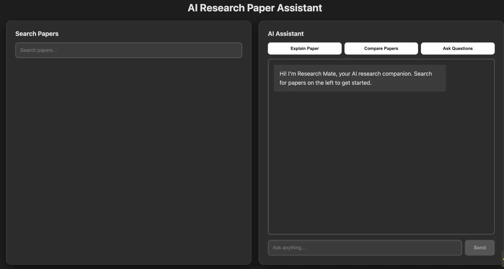
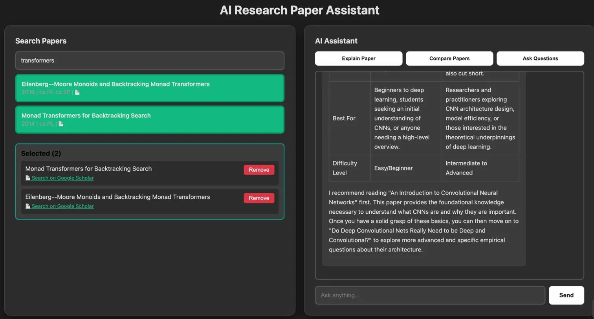
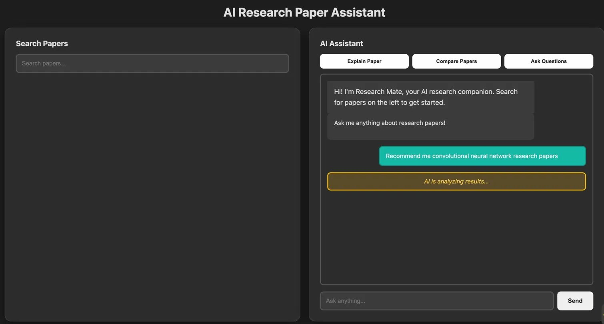
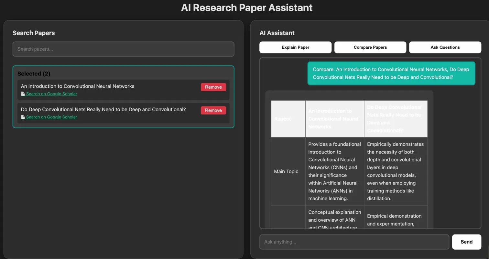

# AI Research Paper Assistant

A serverless, AI-powered platform that lets researchers search 10,000+ academic papers using semantic search and get intelligent answers powered by Google Gemini.

---

## Screenshots

### Home


### Search Papers


### Ask Questions


### Compare Papers


---

## Features

- **Semantic Search** — Search 10,000 ArXiv papers by meaning, not just keywords
- **RAG Q&A** — Ask questions and get AI-powered answers backed by real research papers
- **Explain Paper** — Get any paper explained in simple, clear language
- **Compare Papers** — Side-by-side HTML table comparison of multiple papers
- **Serverless** — Scales automatically, zero idle cost

---

## Architecture

```
User Query
    |
    v
Frontend (S3 Static Site)
    |
    v
API Gateway (REST /chat)
    |
    v
AWS Lambda (Python 3.11)
    |-- HuggingFace API   --> 384-dim query embedding
    |-- S3                --> Load 10K paper embeddings
    |-- Cosine Similarity --> Find top 10 papers
    |-- Gemini 2.5 Flash  --> Generate answer
    |
    v
Response to User
```

---

## Skills Used

**Cloud & DevOps**
- AWS Lambda — serverless compute, Python 3.11 runtime
- AWS S3 — data storage and static website hosting
- AWS API Gateway — REST API design and management
- AWS SageMaker — managed ML notebook environment
- AWS CloudWatch — logging, monitoring, error tracking
- GitHub Actions — CI/CD pipeline, automated deployment

**Machine Learning & AI**
- Sentence Transformers — text embedding generation
- all-MiniLM-L6-v2 — 384-dimensional semantic embeddings
- Cosine Similarity — vector similarity search across 10,000 papers
- RAG (Retrieval Augmented Generation) — context-aware AI responses
- Google Gemini 2.5 Flash — large language model for answer generation
- HuggingFace Inference API — hosted ML model inference

**Data Engineering**
- NumPy — embedding vector storage and operations
- Pandas — data cleaning and preprocessing
- ArXiv Dataset — 10,000 academic paper ingestion and processing

**Backend Development**
- Python 3.11 — core backend language
- REST API design — request/response handling
- Serverless architecture — event-driven compute

**Frontend Development**
- HTML / CSS / JavaScript — single page application
- Fetch API — async REST calls to backend

**Other**
- Git — version control
- Virtual environments — dependency management

---

## Project Structure

```
├── .github/
│   └── workflows/
│       └── deploy.yml                  # CI/CD pipeline
├── data/
│   ├── processed/                      # Cleaned paper data
│   └── raw/                            # Raw ArXiv dataset
├── frontend/
│   └── indexrag.html                   # Single page frontend app
├── lambda/
│   ├── lambda_function.py              # Lambda backend (RAG + embeddings)
│   └── requirements.txt                # Python dependencies
├── notebooks/
│   ├── data_preprocessing.ipynb        # Data cleaning and preparation
│   ├── explore_data.ipynb              # Exploratory data analysis
│   ├── explore_data.py                 # EDA Python script
│   └── generate_embeddings.ipynb       # Generate 384-dim MiniLM embeddings
├── scripts/
│   ├── aws_config.json                 # AWS configuration
│   ├── deploy_to_aws_s3.ipynb          # S3 deployment script
│   └── recommendation_engine.ipynb     # Recommendation engine prototype
├── .gitignore
└── README.md
```

---

## How It Works

### Phase 1 — Data Preparation (AWS SageMaker)
1. Launched SageMaker Notebook Instance (ml.t2.medium) with pre-installed ML libraries
2. Downloaded 10,000 research papers from ArXiv dataset
3. Ran `data_preprocessing.ipynb` — cleaned and normalized titles and abstracts
4. Ran `explore_data.ipynb` — performed exploratory data analysis on the dataset
5. Ran `generate_embeddings.ipynb` — loaded `all-MiniLM-L6-v2` model and generated 384-dimensional embedding vectors for all 10,000 papers
6. Uploaded `paper_embeddings_10k.npy` and `papers_sample_10k.json` to S3
7. SageMaker instance stopped after embedding generation to minimize cost

### Phase 2 — RAG Search Flow
1. User types a question (e.g. "recommend me CNN papers")
2. Lambda calls HuggingFace API — converts query to 384-dim vector
3. Cosine similarity computed against all 10,000 paper vectors
4. Top 5 most relevant papers selected
5. Papers sent to Gemini 2.5 Flash as context
6. Gemini generates an intelligent, cited answer

### Phase 3 — CI/CD
```
git push origin main
    --> GitHub Actions triggers
    --> Frontend deployed to S3
    --> Lambda function updated
    --> Live in ~60 seconds
```

---

## Setup & Deployment

### Prerequisites
- AWS Account
- Google Gemini API Key
- HuggingFace API Token
- GitHub Repository

### Environment Variables (Lambda)
```
GOOGLE_API_KEY=your_gemini_api_key
HF_TOKEN=your_huggingface_token
```

### GitHub Secrets (for CI/CD)
```
AWS_ACCESS_KEY_ID=your_aws_access_key
AWS_SECRET_ACCESS_KEY=your_aws_secret_key
```

### Deploy
```bash
git clone https://github.com/yourusername/research-paper-recommender
cd research-paper-recommender
git push origin main  # triggers auto-deployment
```

---

## Key Metrics

| Metric | Value |
|--------|-------|
| Papers Indexed | 10,000+ |
| Embedding Dimensions | 384 |
| Deployment Time | ~60 seconds |
| Server Cost | $0 (serverless) |
| ML Model | all-MiniLM-L6-v2 |
| LLM | Gemini 2.5 Flash |

---

## Key Concepts

**Embeddings** — Text converted to 384 numbers capturing semantic meaning. Similar papers get similar vectors.

**Cosine Similarity** — Measures angle between vectors to find most relevant papers. Score of 1 = identical meaning.

**RAG (Retrieval Augmented Generation)** — Retrieves relevant papers first, then uses them as context for the LLM. More accurate than pure LLM generation.

**Serverless** — Lambda runs only when called. No idle costs, auto-scales to any traffic.

---

## Future Improvements

- Personalized recommendations using DynamoDB user history
- User authentication
- Paper bookmarking
- Export comparison tables as PDF
- Support for more paper sources (PubMed, IEEE)

---


